# PyTorch Internals, 2026 Edition

*A map of the codebase for people who have never opened it. Written against PyTorch 2.14, released September 2, 2026.*

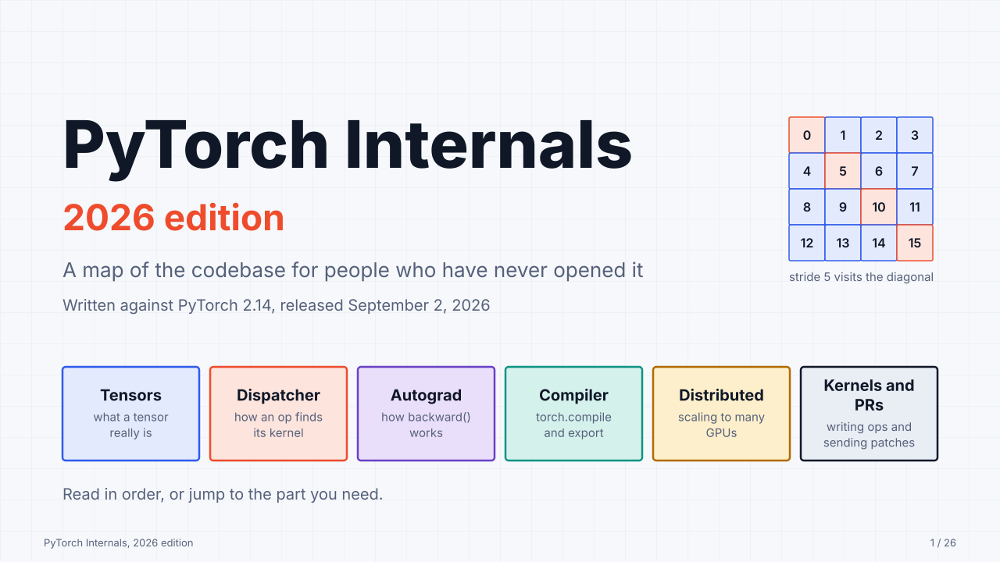

In May 2019, Edward Z. Yang gave a talk called ["PyTorch internals"](https://blog.ezyang.com/2019/05/pytorch-internals/) and published an essay version. It became one of the most-shared guides to how PyTorch is put together. Over the years readers kept asking for an update, and there was a lot to update. In 2019 PyTorch was a tensor library with automatic differentiation. In 2026 it is also a compiler, an export pipeline, a distributed training system and a home for a family of other open source projects.

This post is a fresh take on the same idea, not a line-by-line revision. It keeps the original's goal: **put a map in your hands** so the codebase stops being scary. It follows the original's shape (tensors, dispatch, autograd, kernels, working on the code) and adds what the 2019 version never covered: the autograd section it skipped, the compiler, export, distributed training and modern kernel writing. It is an independent write-up and is not affiliated with the original author or with the PyTorch project.

## Who this is for

You have used PyTorch. You have written `model.to("cuda")` and `loss.backward()`. You are curious what happens underneath, or you want to contribute but the repository looks enormous.

You do **not** need to know C++, compilers or GPU programming. Every term is explained the first time it appears, and each part ends with a one-sentence summary you can carry away. If you never read the 2019 post, nothing here depends on it.

## How to read this

| If you want to... | Read |
| --- | --- |
| Get the 10-minute picture | Part 0, then the summaries at the end of each part |
| Use PyTorch better (debug shapes, memory, speed) | Parts 1 to 5 |
| Understand `torch.compile`, export and deployment | Parts 5 and 6 |
| Understand multi-GPU training | Part 7 |
| Contribute code | Parts 2, 8, 9 and 10 |

**Contents**

- [Part 0: The ten-minute picture](#part-0-the-ten-minute-picture)
- [Part 1: The tensor](#part-1-the-tensor)
- [Part 2: How an operation finds its kernel](#part-2-how-an-operation-finds-its-kernel)
- [Part 3: Autograd](#part-3-autograd)
- [Part 4: Running on GPUs: queues, memory and graphs](#part-4-running-on-gpus-queues-memory-and-graphs)
- [Part 5: The compiler: `torch.compile`](#part-5-the-compiler-torchcompile)
- [Part 6: Export and deployment](#part-6-export-and-deployment)
- [Part 7: Distributed training](#part-7-distributed-training)
- [Part 8: Writing kernels](#part-8-writing-kernels)
- [Part 9: A map of the repository](#part-9-a-map-of-the-repository)
- [Part 10: Working on PyTorch efficiently](#part-10-working-on-pytorch-efficiently)
- [Part 11: What changed, and what to watch](#part-11-what-changed-and-what-to-watch)
- [Ten things to try](#ten-things-to-try) | [Questions readers asked](#questions-readers-asked-in-2019-and-a-few-more) | [Cheat sheet](#environment-variable-cheat-sheet) | [Further reading](#further-reading)

Slides are inline as SVG images. If your Markdown viewer does not show them, keep the `img/` folder next to this file.

> **A note on accuracy.** I checked version-specific claims against the official [2.11](https://pytorch.org/blog/pytorch-2-11-release-blog/), [2.13](https://pytorch.org/blog/pytorch-2-13-release-blog/) and [2.14](https://pytorch.org/blog/pytorch-2-14-release-blog/) release notes and the current [CONTRIBUTING.md](https://github.com/pytorch/pytorch/blob/main/CONTRIBUTING.md). Internals move fast, though. Treat file paths as starting points and search the repository before relying on one. Code samples marked "abridged" or "simplified" are shortened to show the idea, so the real source will differ.

## Words you will see

| Word | Plain meaning |
| --- | --- |
| **Tensor** | An n-dimensional array of numbers, plus a description of how to read it |
| **Operator (op)** | A named operation such as `add`, `mm` (matrix multiply) or `tanh` |
| **Kernel** | One concrete implementation of an operator for one kind of hardware |
| **Backend** | A family of hardware and its kernels: CPU, CUDA, MPS and so on |
| **Dispatch** | Choosing which kernel to run for a given call |
| **Autograd** | The machinery behind `backward()`: it computes gradients automatically |
| **Graph** | A recorded list of operations and how they connect |
| **Compiler** | A program that rewrites your program into a faster one |
| **GPU stream** | A queue of GPU work that runs in order |

## What is different from 2019

If you did read the original, here is the short list of what changed. If you did not, skim it and come back at the end.

| Topic | 2019 | 2026 |
| --- | --- | --- |
| Autograd wrapper | `Variable` wrapped `Tensor` | One tensor type; autograd info lives inside it |
| How calls pick kernels | A virtual `Type` object | The c10 dispatcher with a set of dispatch keys, layered like middleware |
| Legacy C kernels (`TH`, `THC`) | Large part of the codebase | Ported to modern C++ (see Part 8) |
| Storage | Typed (knew its dtype) | Raw bytes (`UntypedStorage`); dtype lives on the tensor |
| Extending tensors | Device, layout, dtype, plus wrapper classes | Plus Python tensor subclasses and `__torch_dispatch__` |
| The "future" | TorchScript JIT | Deprecated; replaced by `torch.compile` and `torch.export` |
| Training at scale | Data parallel on a few GPUs | FSDP2, DTensor, device meshes, fault-tolerant collectives |
| Writing GPU kernels | CUDA C++ | Also Triton, CuTeDSL and Helion, with a path into core |
| Governance | Facebook | PyTorch Foundation (Linux Foundation) |
| Building | `setup.py develop` | `pip install -e` or `spin develop`; scikit-build-core |
| CPU vector helpers | `Vec256` | `Vectorized` |

---

## Part 0: The ten-minute picture

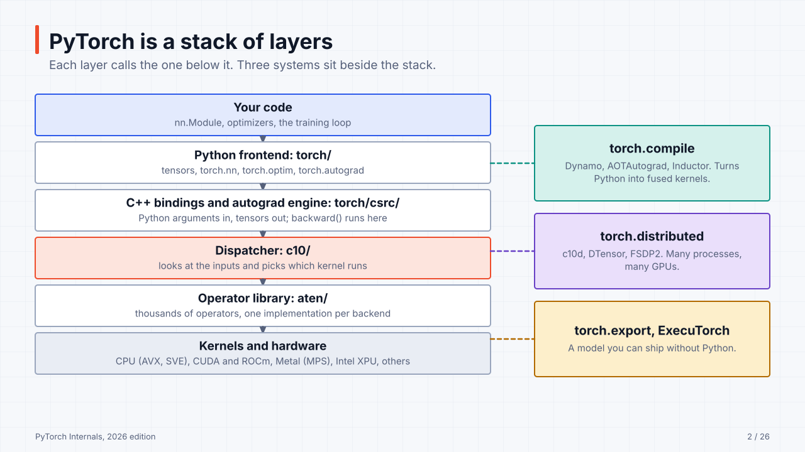

Think of PyTorch as a **stack of layers**. Your code is at the top. Hardware is at the bottom. Each layer only calls the one below it.

1. **Your code**: `nn.Module`, an optimizer, a training loop.
2. **The Python frontend** (`torch/`): the Python modules you import.
3. **The C++ bindings and autograd engine** (`torch/csrc/`): translate Python arguments to C++ and back, and run `backward()`.
4. **The dispatcher** (`c10/`): looks at the inputs of every call and decides which kernel should run.
5. **The operator library** (`aten/`, short for "A Tensor Library"): thousands of operators, each with an implementation per backend.
6. **Kernels and hardware**: vectorized CPU loops, CUDA and ROCm kernels, Apple Metal shaders, Intel GPU code.

Beside the stack sit three big systems. **`torch.compile`** reads your Python and writes faster kernels. **`torch.distributed`** runs one model across many GPUs. **`torch.export`** and **ExecuTorch** package a model so it can run without Python.

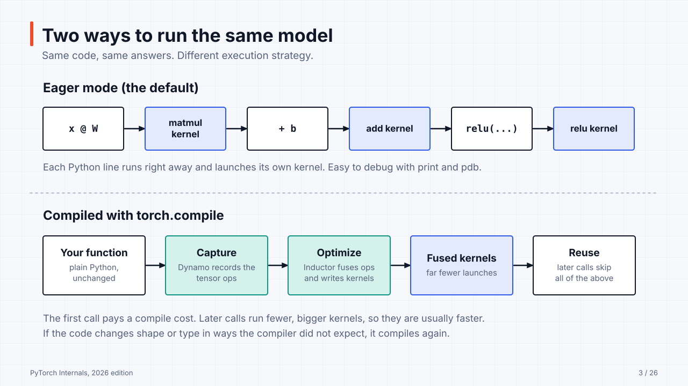

There are also two ways to run the same code. In **eager mode**, the default, every Python line runs immediately and launches its own kernel. That is why `print` and debuggers just work. In **compiled mode**, PyTorch captures your function once, optimizes it, and reuses the result. We will cover both. Eager mode comes first because the compiler is built on top of it.

### A running example

Most of this post follows one line of code:

```python
import torch

x = torch.randn(2, 3)
W = torch.randn(3, 3, requires_grad=True)

y = torch.tanh(x @ W)     # a matrix multiply, then tanh
loss = y.sum()
loss.backward()           # gradients land in W.grad
```

By the end you will know what every step of those five lines does inside PyTorch.

> **In one sentence:** PyTorch is layers of translation from Python down to hardware, with a dispatcher in the middle choosing kernels, an autograd engine on the side recording what happened, and a compiler that can replace the whole thing with faster code.

---

## Part 1: The tensor

### 1.1 Data plus a description

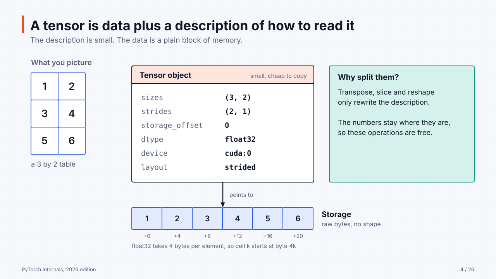

A tensor is an n-dimensional array. You picture a table of numbers. Inside PyTorch it is two things:

- **The data**, stored in one flat block of memory (the *storage*).
- **A description of how to read the data**: the sizes, the *strides*, an offset, the dtype (what each element is), and the device (where the memory lives).

The description is tiny. The data can be gigabytes. Keeping them separate is the central design idea of the whole library, and it explains why many operations are free.

### 1.2 Strides

![Strides turn an index like t[1, 0] into a memory address](img/05-strides-index-math.svg)

Memory is one-dimensional, so a 3 by 2 table has to be laid out in a line. The usual layout writes row after row ("row-major"). The six numbers sit next to each other, and the sizes `(3, 2)` are remembered separately.

To find where `t[i, j]` lives, PyTorch needs one more piece of metadata, the **stride** of each dimension: how many cells you skip when that index goes up by one.

```
address = offset + i * stride[0] + j * stride[1]
```

For our contiguous 3 by 2 tensor the strides are `(2, 1)`. Moving down a row skips two cells. Moving right one column skips one. So `t[1, 0]` is at `1*2 + 0*1 = 2`, which holds the value 3. Every element lookup is one multiply-add per index.

Try it:

```python
t = torch.tensor([[1, 2], [3, 4], [5, 6]])
print(t.shape, t.stride(), t.storage_offset())   # torch.Size([3, 2]) (2, 1) 0
print(t.is_contiguous())                         # True
```

### 1.3 Views are free

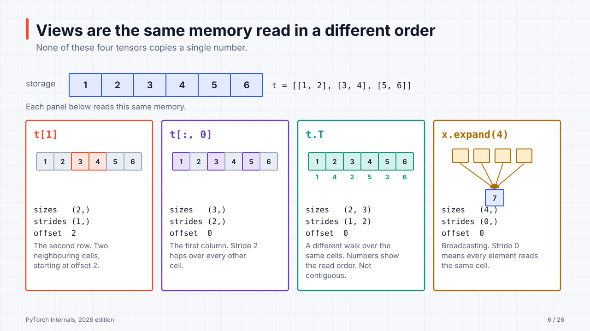

Because the description is separate from the data, you can make a *different description of the same data*. That is a **view**. No numbers are copied.

```python
row  = t[1]       # sizes (2,),  strides (1,), offset 2
col  = t[:, 0]    # sizes (3,),  strides (2,), offset 0   (hops over every other cell)
tt   = t.T        # sizes (2, 3), strides (1, 2)           (a different walk, no copy)
b    = torch.tensor([7]).expand(4)   # sizes (4,), strides (0,)  (stride 0 repeats a cell)
```

Three consequences are worth remembering.

**Writing through a view changes the original.** `row[0] = 99` changes `t[1, 0]`, because they are the same memory.

**Not every tensor is contiguous.** After a transpose, reading in logical order jumps around memory. Some kernels need contiguous input, so PyTorch sometimes calls `.contiguous()` for you, which copies. `view()` refuses when the strides cannot express the new shape. `reshape()` returns a view when it can and copies when it must.

**Memory layout is a choice, not a law.** `x.to(memory_format=torch.channels_last)` keeps a tensor logically shaped `(N, C, H, W)` but stores it channel-last by changing only the strides. The shape you see stays the same.

The [Stride Visualizer](https://ezyang.github.io/stride-visualizer/index.html) from the original post is still a good way to build intuition.

### 1.4 Tensor and storage

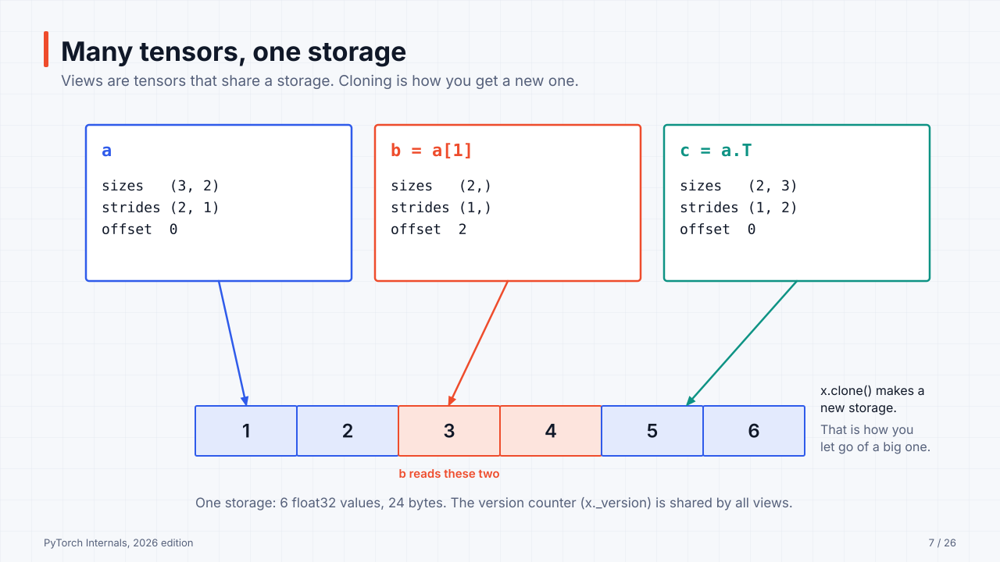

A **storage** is the block of memory. Many tensors can point into one storage. In the picture, `a`, `b = a[1]` and `c = a.T` all share the same six numbers, each with its own sizes, strides and offset.

Two details changed since 2019:

- **Storage no longer knows its dtype.** It is `UntypedStorage`: just bytes. The tensor says how to interpret them. You may still see a warning about `TypedStorage`; that is the old design being retired.
- **Every tensor has a version counter** (`x._version`), shared by all views of the same storage. It goes up when you modify a tensor in place. Autograd uses it to catch mistakes (Part 3).

**A common memory trap.** A tiny view keeps the entire storage alive:

```python
big   = torch.randn(10_000_000)
small = big[:10]
del big                       # the 40 MB is NOT freed: `small` still points into it
small = small.clone()         # clone() makes a new, small storage; now the big one can go
```

If you keep a small slice of a large tensor, clone it. (Java programmers will recognize this from how substrings once worked.)

### 1.5 What is inside a tensor object

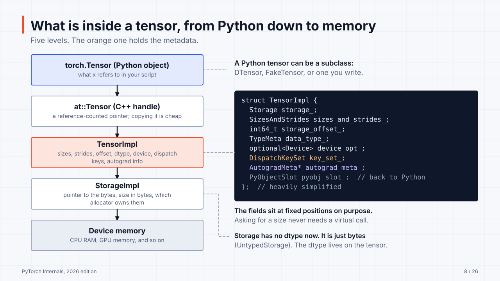

When you write `x = torch.randn(3)`, you hold a Python object. Underneath are four more levels:

1. **`torch.Tensor`**, the Python object you see.
2. **`at::Tensor`**, a C++ handle that is a reference-counted pointer. Copying it is cheap and does not copy data.
3. **`TensorImpl`**, the struct that holds the metadata: sizes, strides, offset, dtype, device, a set of *dispatch keys* (Part 2) and an `AutogradMeta` pointer (Part 3).
4. **`StorageImpl`**, which holds the pointer to bytes, the size in bytes and which allocator owns them.
5. The actual **device memory**.

A heavily simplified version of the struct:

```cpp
struct TensorImpl {
  Storage storage_;
  SizesAndStrides sizes_and_strides_;
  int64_t storage_offset_;
  TypeMeta data_type_;
  optional<Device> device_opt_;
  DispatchKeySet key_set_;
  AutogradMeta* autograd_meta_;
  PyObjectSlot pyobj_slot_;   // link back to the Python object
};
```

One design rule from 2019 still holds: **the layout is deliberately fixed**. Asking for a tensor's size is among the most frequent things any kernel does, so it must never need a virtual function call. Different kinds of tensors (sparse, nested) store their extra fields in a part of the struct reserved for them. Sizes can also be *symbolic* when the compiler traces with dynamic shapes (Part 5).

### 1.6 Device, layout, dtype, and how to extend them

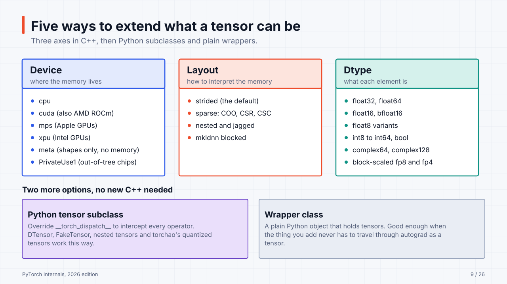

Every tensor is described by three independent choices:

- **Device**: where the memory lives. `cpu`, `cuda` (AMD ROCm also appears as `cuda`), `mps` for Apple GPUs, `xpu` for Intel GPUs, and `meta`, which has shapes but no memory at all. A slot called `PrivateUse1` exists so outside projects can add their own hardware without changing PyTorch.
- **Layout**: how memory is interpreted. Strided is the default. Sparse formats (COO, CSR, CSC), nested/jagged tensors for variable-length sequences, and oneDNN's blocked layouts also exist.
- **Dtype**: what each element is. `float32`, `bfloat16`, `float16`, integers, booleans, complex numbers, 8-bit floats, and increasingly block-scaled 8-bit and 4-bit formats used by recent GPUs.

Not every combination has kernels (nobody has sparse, quantized tensors on every chip), but all combinations can be expressed.

When you want to add something new to tensors, you now have **five** options. In the 2019 post there were four, and the Python-subclass option did not exist yet.

1. A new **device**: add hardware.
2. A new **layout**: add a data representation.
3. A new **dtype**: add an element type.
4. A **Python tensor subclass** that overrides `__torch_dispatch__`. This intercepts every operator that touches your tensor. It is how `DTensor` (sharded tensors), `FakeTensor` (tensors without data, used by the compiler), nested tensors and `torchao`'s quantized tensors are built, and it needs no C++.
5. A plain **wrapper class** that holds tensors.

The 2019 rule of thumb for choosing between "extend the tensor" and "write a wrapper" still works: *does your object need to travel through autograd as a tensor?* If yes, extend the tensor (options 1 to 4). If not, a wrapper (option 5) is simpler and can live entirely outside PyTorch.

> **In one sentence:** a tensor is a small description (sizes, strides, dtype, device) pointing at a block of raw memory, which is why transposes, slices and broadcasts cost nothing.

---

## Part 2: How an operation finds its kernel

### 2.1 Operators and schemas

Everything you do to a tensor is an **operator**. `x + y`, `torch.add(x, y)` and `x.add(y)` all call the same one, named `aten::add` with the variant (overload) `Tensor`. Each operator has a **schema**, a typed signature:

```python
print(torch.ops.aten.add.Tensor._schema)
# aten::add.Tensor(Tensor self, Tensor other, *, Scalar alpha=1) -> Tensor
```

A schema looks a bit like a Python type annotation, but it also records things the compiler and autograd need, such as which arguments get modified in place.

### 2.2 The journey of `a + b`

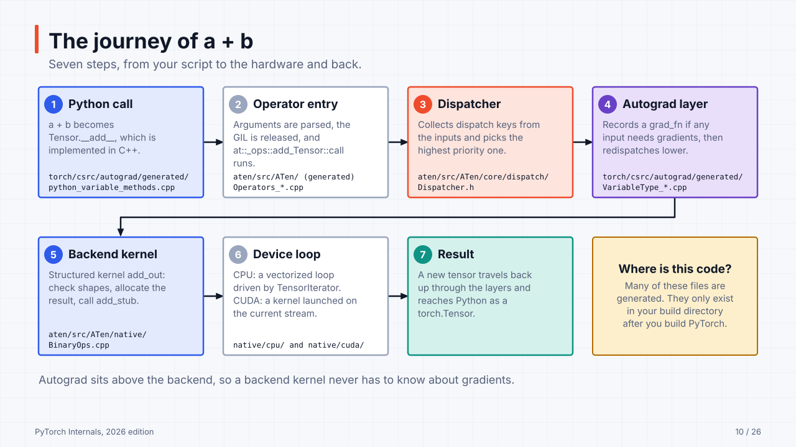

Here is the path of one addition, from your script to the hardware.

1. **Python call.** `a + b` calls `Tensor.__add__`, a C++ function exposed to Python.
2. **Operator entry point.** Generated code parses the Python arguments into C++ values, releases Python's global interpreter lock (GIL) so other threads can run, and calls `at::_ops::add_Tensor::call(...)`.
3. **The dispatcher.** It collects the dispatch keys from the inputs and picks the highest-priority one (more in 2.3).
4. **Autograd layer.** If any input needs gradients, this layer creates a backward node and attaches it to the result (Part 3). Then it *redispatches*: it calls the dispatcher again with the autograd keys removed.
5. **Backend kernel.** For `add` this is a *structured kernel*: one function checks the shapes and picks the output size, another does the work.
6. **Device loop.** On CPU, a vectorized loop driven by a helper called `TensorIterator`. On CUDA, a kernel launched on the current stream.
7. **Result.** A new tensor travels back up through the layers and reaches Python as a `torch.Tensor`.

Most of steps 1 to 4 is **generated code**. If you search the GitHub repository for `THPVariable_add` you will not find it. It is written at build time from a small set of declarations (Part 8). That surprised almost every newcomer in 2019 and still does. The advice stands: skim the generated code to get your bearings, then jump straight to the kernel.

### 2.3 Dispatch keys: a stack of layers

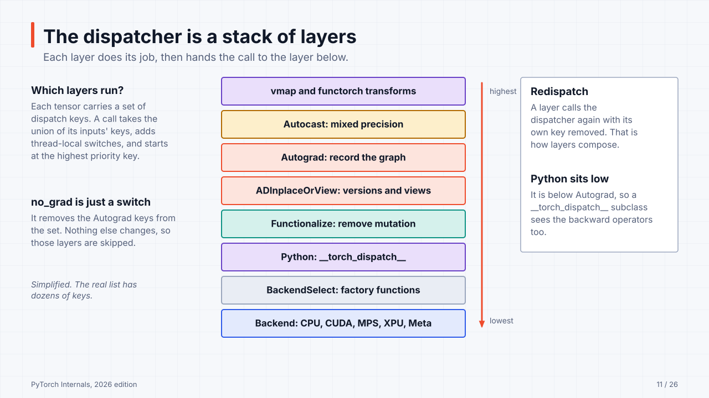

In 2019 the dispatch had two steps: pick by device and layout, then pick by dtype. The first step has grown into something richer.

Every tensor carries a small set of **dispatch keys**, a bitmask. For a call, PyTorch takes the union of the keys on all input tensors, adds some thread-local switches, and starts at the **highest-priority key**. Each key names a *layer* that wants to act on the call. A simplified view, top to bottom:

- **vmap and other `torch.func` transforms**: batch a function automatically.
- **Autocast**: casts inputs to lower precision for mixed-precision training.
- **Autograd**: records the graph for `backward()`.
- **ADInplaceOrView**: bumps version counters and tracks views.
- **Functionalize**: rewrites mutations into pure operations (the compiler uses this).
- **Python**: calls your `__torch_dispatch__`.
- **BackendSelect**: routes factory functions like `torch.zeros`, which have no tensor input to inspect.
- **The backend**: CPU, CUDA, MPS, XPU, Meta and others.

(The real list has dozens of keys, and the exact order changes as features are added.)

Each layer does its job and then **redispatches** to the layers below it, with its own key removed. This is the same idea as *middleware* in a web server. It is why features compose: autograd does not need to know about CUDA, and vmap does not need to know about autograd.

Two payoffs are worth knowing:

- **`torch.no_grad()` is just a switch.** It removes the Autograd keys from the set, so those layers are skipped. Nothing else changes.
- **Python sits below Autograd.** A `__torch_dispatch__` subclass therefore sees *backward* operators as well as forward ones, which is exactly what the compiler needs to capture a training step.

This replaced the 2019 design, where a virtual `Type` object did the dispatch and a `Variable` wrapper handled autograd. Merging `Variable` into `Tensor` (around 2020) and moving to dispatch keys made PyTorch much easier to extend.

### 2.4 The second dispatch: dtype

Once you reach a backend kernel you are past the "which hardware" question, but the code that adds `float32` numbers differs from the code that adds `int64`. Kernels handle this with a macro that expands into a `switch` over dtypes, for example `AT_DISPATCH_FLOATING_TYPES_AND2(kHalf, kBFloat16, ...)`. This is an ordinary compile-time dispatch, not a dynamic one. The mental picture from 2019 still holds: **first** a dynamic dispatch on device and features, **then** a static switch on dtype.

### 2.5 See it yourself

You can watch the operators that reach the Python layer, with no C++ at all:

```python
from torch.utils._python_dispatch import TorchDispatchMode

class LogOps(TorchDispatchMode):
    def __torch_dispatch__(self, func, types, args=(), kwargs=None):
        print(func)
        return func(*args, **(kwargs or {}))

x = torch.randn(2, 3)
W = torch.randn(3, 3, requires_grad=True)

with LogOps():
    y = torch.tanh(x @ W)
# aten.mm.default
# aten.tanh.default
```

Now wrap `y.sum().backward()` in the same `with` block and read the extra lines. Among them you will see backward operators such as `aten.tanh_backward.default`. That is the Python key sitting below Autograd, as promised.

For a deeper look at the C++ dispatcher, Edward Yang's later post ["Let's talk about the PyTorch dispatcher"](http://blog.ezyang.com/2020/09/lets-talk-about-the-pytorch-dispatcher/) is still the best single reference.

> **In one sentence:** every call goes through a stack of layers (autograd, mixed precision, tracing and so on) chosen by the tensors' dispatch keys, and finally reaches one kernel for the right hardware and dtype.

---

## Part 3: Autograd

The 2019 talk skipped its seven autograd slides and promised a sequel that never arrived. Here is the sequel.

### 3.1 What autograd does

Training a network means adjusting numbers (weights) to reduce a loss. For that you need the **gradient**: how much the loss changes if each weight changes slightly. Writing those formulas by hand for every layer would be impractical, so PyTorch computes them automatically with **reverse-mode automatic differentiation**.

The key fact is the *chain rule*. If `loss` depends on `y`, and `y` depends on `h`, and `h` depends on `W`, then the effect of `W` on `loss` is the product of the effects along that chain. Reverse mode computes these products starting from the loss and walking *backward* through the computation. That is why it is so efficient for neural networks: one backward walk gives the gradient for every weight.

PyTorch does this **without rewriting your source code**. Instead it records what happened while your code ran, then replays it backward.

### 3.2 The recorded graph

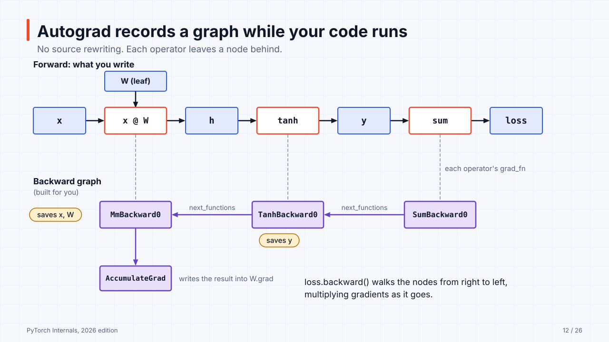

Take our running example. As the forward code runs, each operator that touches a tensor with `requires_grad=True` leaves a **node** behind:

```python
x = torch.randn(2, 3)
W = torch.randn(3, 3, requires_grad=True)
y = torch.tanh(x @ W)
loss = y.sum()

print(loss.grad_fn)                  # <SumBackward0 ...>
print(loss.grad_fn.next_functions)   # ((<TanhBackward0 ...>, 0),)
print(y.grad_fn.next_functions)      # ((<MmBackward0 ...>, 0),)
```

- Each result tensor has a **`grad_fn`**: the backward node for the operator that produced it (`SumBackward0`, `TanhBackward0`, `MmBackward0`).
- Each node lists its inputs as **edges** (`next_functions`), pointing to the nodes of whatever produced *its* inputs.
- A **leaf** tensor that needs gradients, such as `W`, gets a special `AccumulateGrad` node. Its job is to add the incoming gradient into `W.grad`.
- Nodes keep what they need for the backward formula as **saved tensors**. `tanh` saves its output `y` (its derivative is `1 - y²`). `mm` saves both `x` and `W`.

Look at the structure: it mirrors the forward code, but each forward operator is replaced by its derivative. In the 2019 slide this was drawn as source code; in reality it is a graph of C++ objects, never written out as text.

### 3.3 Where the code lives

Autograd is a mix of hand-written and generated code:

- **`AutogradMeta`** is stored inside every `TensorImpl` (the 2019 design wrapped it in a separate `Variable`). It holds `requires_grad`, `grad_fn`, the accumulated `.grad` and a version counter.
- **`tools/autograd/derivatives.yaml`** is where backward formulas are declared. An abridged entry looks like:

  ```yaml
  - name: tanh(Tensor self) -> Tensor
    self: tanh_backward(grad, result)
  ```

  From this, the code generator writes the `TanhBackward0` node class and the *autograd kernel* that creates it. The generated kernels land in `torch/csrc/autograd/generated/` (the `VariableType_*.cpp` files) once you build. More complex formulas live in hand-written helper code such as `FunctionsManual.cpp`.
- **`torch/csrc/autograd/`** holds `Node`, the `Engine`, saved-variable handling, hooks and the Python bindings for all of it.

One small design detail answers a question from the 2019 comments: why does a tensor hold only a *weak* pointer to its `AccumulateGrad` node? Because that node holds a *strong* pointer to the tensor it updates. If both were strong they would keep each other alive forever, so one side must be weak.

### 3.4 The engine

When you call `loss.backward()`, the **engine** (`torch/csrc/autograd/engine.cpp`) takes over:

1. It starts at `loss.grad_fn` with an initial gradient of 1.
2. It counts how many consumers each node has, so it knows when a node has received all of its incoming gradients.
3. It runs nodes in an order where later forward operations run first. A node that feeds several consumers waits until every incoming gradient has been *summed*.
4. Each node's backward function turns "gradient of my output" into "gradients of my inputs" and sends them along the edges.
5. `AccumulateGrad` finally writes into `W.grad`.

The engine uses one worker thread per device so that GPU work for backward can be queued without waiting on CPU work, and it runs hooks (functions you register to inspect or change gradients) at the right moments.

### 3.5 The in-place hazard

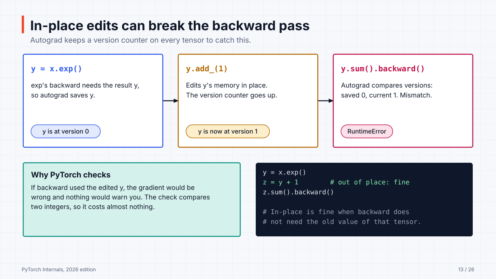

Saved tensors create a risk. If you modify one in place, backward would silently use the wrong numbers:

```python
y = x.exp()        # exp's backward needs y, so autograd saves it (version 0)
y.add_(1)          # edits y in place: version becomes 1
y.sum().backward() # RuntimeError: a variable needed for gradient computation
                   # has been modified by an inplace operation
```

PyTorch catches this by comparing the saved version with the current one, which costs two integer reads. The `ADInplaceOrView` layer from Part 2 is what bumps the counters. The fix is almost always to write `z = y + 1` instead of `y.add_(1)`, or to clone first. In-place operations are fine when backward does not need the old value.

### 3.6 Autograd's modern toolbox

Autograd in 2026 is much more than `backward()`:

| Tool | What it gives you |
| --- | --- |
| `torch.autograd.Function` | Define your own op with your own forward and backward |
| Tensor and module hooks | Look at or modify gradients as they flow |
| `create_graph=True` | Differentiate through the backward pass (second derivatives, gradient penalties) |
| `torch.func` (`grad`, `vmap`, `jvp`, `jacrev`) | Composable function transforms, implemented as dispatch layers |
| Forward-mode AD | Compute directional derivatives going *forward*, which is cheaper for some problems |
| `torch.utils.checkpoint` | Recompute activations in backward instead of storing them, to save memory |
| `torch.autograd.graph.saved_tensors_hooks` | Intercept what gets saved (for example, to offload to CPU) |
| `node_creation_hook` (new in 2.14) | Run a callback as each backward node is created, so tools can attribute backward memory to the forward code that caused it |
| `torch.inference_mode()` | Like `no_grad`, with extra savings because tensors are never seen by autograd at all |

In compiled mode (Part 5), autograd is not skipped. A component called AOTAutograd runs it *ahead of time* and records the backward pass as a graph.

> **In one sentence:** while your code runs, each operator leaves a backward node behind (with the tensors it needs), and `backward()` walks those nodes in reverse, multiplying gradients until they land in `.grad`.

---

## Part 4: Running on GPUs: queues, memory and graphs

Almost every question about "why is my GPU code slow or out of memory?" is answered by three ideas: GPU work is **asynchronous**, memory is **cached**, and tiny kernels are **expensive in bulk**.

### 4.1 GPU work is queued

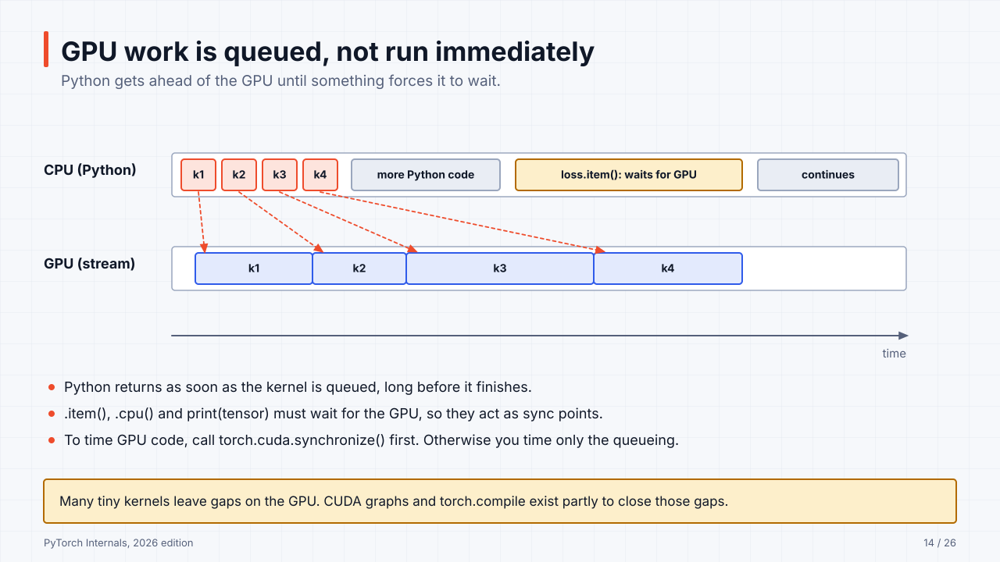

When Python calls a CUDA operator, PyTorch does not wait for the GPU to finish. It places the kernel on a **stream**, a queue of GPU work that runs in order, and immediately returns control to Python. Your script runs ahead of the GPU.

This is good for throughput, but it has consequences:

- **Errors can show up late.** A bad index in a kernel may be reported several lines after the line that caused it. Setting `CUDA_LAUNCH_BLOCKING=1` makes every launch wait, which makes the failing line obvious (at the cost of speed).
- **Some calls must wait.** `.item()`, `.cpu()`, `print(tensor)` and anything that needs the actual number are *synchronization points*. The CPU stops until the GPU catches up.
- **Naive timing is wrong.** `time.time()` around a GPU call measures only the queueing. Call `torch.cuda.synchronize()` before reading the clock, or use `torch.cuda.Event` timers or the profiler.

A stray `.item()` inside a training loop is one of the most common hidden slowdowns. It forces a wait every step.

### 4.2 The caching allocator

Asking the GPU driver for memory (`cudaMalloc`) is slow. So PyTorch keeps a **caching allocator**: when a tensor is freed, its memory goes back to a pool inside PyTorch rather than to the driver, and the next allocation reuses it. Two numbers matter:

- `torch.cuda.memory_allocated()`: memory used by live tensors.
- `torch.cuda.memory_reserved()`: memory PyTorch has grabbed from the driver, including cached free blocks.

`nvidia-smi` shows the *reserved* number, which is why it often looks larger than your tensors. "Out of memory" can also happen with plenty of total free memory if it is split into pieces too small for the request. That is *fragmentation*, and a setting called `expandable_segments` (via the `PYTORCH_ALLOC_CONF` environment variable; the older `PYTORCH_CUDA_ALLOC_CONF` name still works) reduces it.

To see where memory goes, record a **memory snapshot**:

```python
torch.cuda.memory._record_memory_history()
# ... run a few training steps ...
torch.cuda.memory._dump_snapshot("snapshot.pickle")   # open at pytorch.org/memory_viz
```

The viewer shows a timeline of every allocation with its stack trace. New in 2.14: passing `record_host=True` also records *pinned* CPU memory, the page-locked buffers used to stage transfers to the GPU.

### 4.3 Many tiny kernels, and CUDA graphs

Launching a kernel costs a few microseconds of CPU time. If your model runs thousands of very small kernels, the GPU spends much of its time idle, waiting for the next launch. Two tools help:

- **Fusing kernels** (what `torch.compile` does, Part 5) means fewer, larger kernels.
- **CUDA graphs** record a whole sequence of kernel launches once and then *replay* it with a single launch. `torch.compile(..., mode="reduce-overhead")` uses them, and recent releases keep adding support (2.14 can capture a `while_loop` with a data-dependent trip count inside a graph, among other things).

PyTorch is also becoming device-agnostic at this level. The `torch.accelerator` namespace offers one API over CUDA, Apple's MPS, Intel's XPU and others, and since 2.12 it includes a device-agnostic graph API. Intel's XPU backend gained native graph capture in 2.14.

### 4.4 Profiling

`torch.profiler` records CPU and GPU activity and writes a trace you can open in Chrome or Perfetto. If you see long gaps between GPU kernels, you have a launch-overhead or synchronization problem. If the kernels are back to back, the problem is inside the kernels. 2.13 added an experimental profiler backend that collects GPU metrics without disturbing the timing of multi-threaded programs.

> **In one sentence:** the CPU queues GPU work and runs ahead of it, PyTorch reuses freed GPU memory instead of returning it, and the cure for many tiny kernels is fusion or CUDA graphs.

---

## Part 5: The compiler: `torch.compile`

This is the biggest change since 2019 and the reason the 2.x version numbers exist.

### 5.1 Why compile?

Eager mode is simple and flexible, but it has two costs.

**Python overhead.** Every operator call goes through Python, the bindings and the dispatcher, then launches a kernel. For small operators this overhead can exceed the actual work.

**Memory traffic.** Look at this line:

```python
y = torch.relu(x * 2 + 1)
```

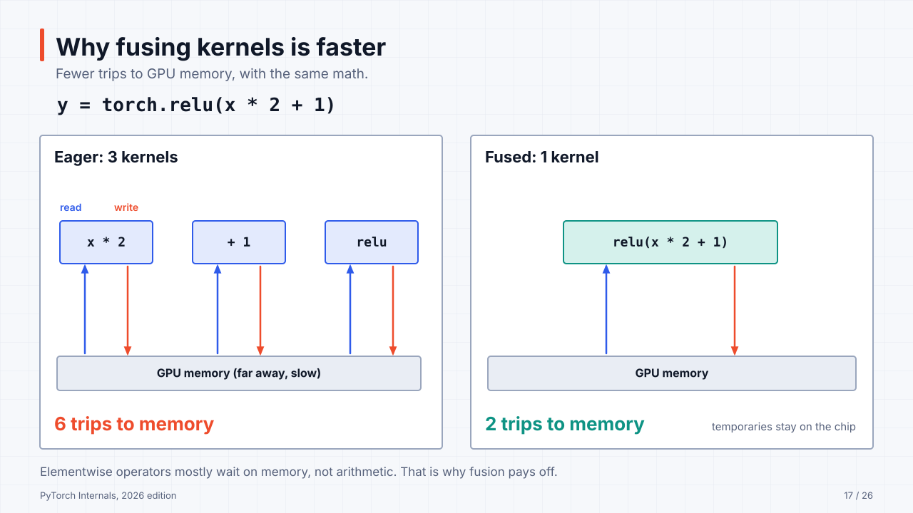

In eager mode that is three kernels. Each one reads its input from GPU memory and writes its output back, so the temporaries `x * 2` and `x * 2 + 1` take a round trip to memory for no reason. A **fused** kernel reads `x` once, does all three steps in registers on the chip, and writes `y` once. Elementwise operators spend nearly all their time waiting on memory, not doing arithmetic, so cutting trips from six to two is a large win.

Fusion is something a *compiler* can do automatically, but only if it can see several operators at once. `torch.compile` exists to give it that view without changing how you write PyTorch.

### 5.2 The pipeline

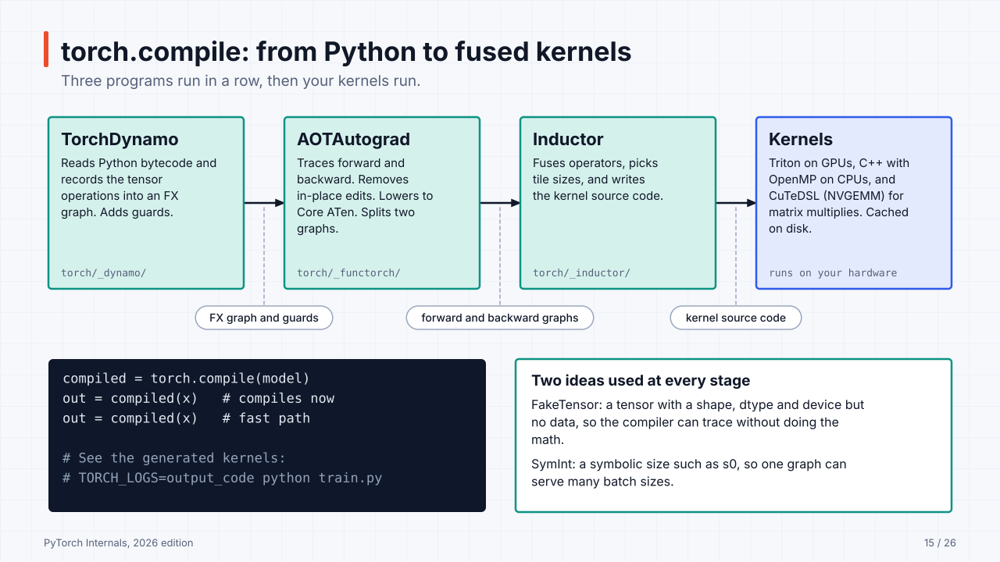

```python
compiled = torch.compile(model)
out = compiled(x)     # first call: compile (slow)
out = compiled(x)     # later calls: run the compiled code (fast)
```

When you call `torch.compile(model)`, three programs run in sequence the first time the model is called:

1. **TorchDynamo** captures your Python as a graph.
2. **AOTAutograd** adds the backward pass and lowers everything to a small, stable set of operators.
3. **Inductor** fuses operators and writes kernel source code.

Two ideas run through all three stages:

- **FakeTensor**: a tensor with a shape, dtype and device but *no data*. The compiler traces your model with fake tensors so it learns every output shape without doing any math.
- **SymInt**: a *symbolic* integer like `s0`, standing for a size that is not fixed. This lets one graph serve many batch sizes.

### 5.3 Stage 1: TorchDynamo reads your bytecode

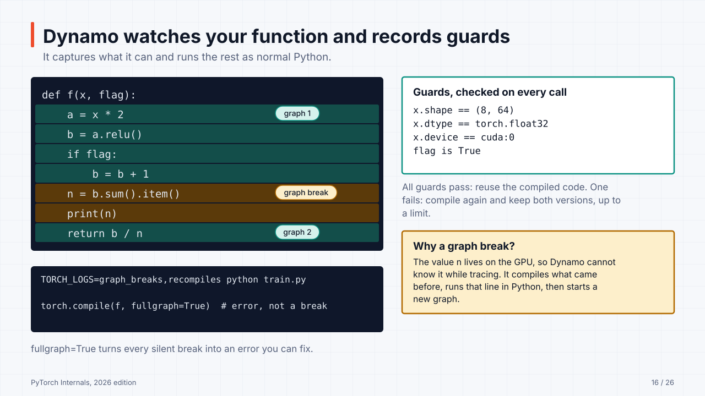

Python compiles your source into **bytecode**, a list of simple instructions, before running it. Dynamo hooks into CPython's frame evaluation (a mechanism from PEP 523). When your function is about to run, Dynamo reads its bytecode and executes it *symbolically*: whenever it meets a tensor operation, it records the operation into an **FX graph** instead of running it. Plain Python (loops over constants, helper function calls, list handling) it simply evaluates during tracing.

This is a big reason `torch.compile` works on ordinary code. It does not require a special language or decorators on every function.

**Guards.** The graph Dynamo records is only valid under certain assumptions: this input has shape `(8, 64)`, this flag was `True`, that global has this value. Dynamo records these assumptions as **guards**. On every later call it checks the guards first. If they all pass, it runs the compiled code. If one fails, it compiles again and keeps both versions, up to a limit (a small number by default).

**Graph breaks.** Sometimes Dynamo cannot continue. The classic example is `.item()`: the value lives on the GPU, so Dynamo cannot know it during tracing. It compiles everything before that line, hands that one line back to normal Python, then starts a new graph afterward. This is a *graph break*. The code still runs correctly, but you lose fusion across the break. Common causes are:

- `.item()` or converting a tensor to a Python number,
- Python `if` on a tensor's *value* (not its shape),
- calls into libraries Dynamo cannot trace.

Find them with `TORCH_LOGS=graph_breaks`, or make them errors with `torch.compile(f, fullgraph=True)`.

**Dynamic shapes.** If a function is called with shape `(8, 64)` and then `(16, 64)`, Dynamo notices and recompiles *once* with the batch size as a symbolic variable (`s0`). Later calls with other batch sizes reuse that graph. You can ask for this up front with `torch._dynamo.mark_dynamic(x, 0)`. New and experimental in 2.14: **`@dynamic_spec`**, a single declarative way to say which dimensions may vary (`ShapeVar("batch", min=2, max=128)`), shared across `torch.compile`, `torch.export` and `make_fx`. Dimensions declared this way are treated as truly unknown, so shape-dependent branching becomes a data-dependent error instead of a silent recompile.

### 5.4 Stage 2: AOTAutograd

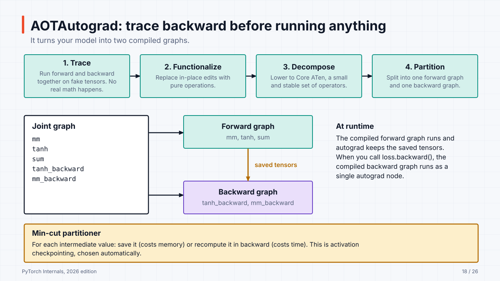

Dynamo gives you a *forward* graph. Training also needs the backward pass, and this is where **AOTAutograd** (short for "ahead-of-time autograd", under `torch/_functorch/`) comes in. It does four things:

1. **Trace forward and backward together** using fake tensors. It does this by running the real autograd engine from Part 3 on tensors that carry no data, and recording every operator that runs. The result is a *joint graph*.
2. **Functionalize.** Compilers find mutation hard to reason about: `x.add_(1)` changes something that other code may be reading. Functionalization rewrites in-place operations into pure ones and records separately what to write back to the inputs at the end.
3. **Decompose.** PyTorch has thousands of operators, but many can be expressed with simpler ones. AOTAutograd lowers everything to **Core ATen**, a small stable operator set, so the compiler needs to understand far fewer.
4. **Partition** the joint graph into a **forward graph** and a **backward graph**. The tensors that cross from forward to backward are the *saved tensors*.

The partitioner uses a **min-cut algorithm** to decide, for each intermediate value, whether to save it (costs memory) or recompute it during backward (costs time). This is *activation checkpointing*, which you may have applied by hand with `torch.utils.checkpoint`, chosen automatically.

At runtime, autograd sees one big node wrapping the compiled backward graph.

### 5.5 Stage 3: Inductor

**Inductor** (`torch/_inductor/`) takes the graphs and produces fast code:

1. **Lowering** converts each operator into a loop-level description: "for each element, compute this expression" or "reduce along this axis".
2. **Scheduling and fusion** looks for neighbors that can share one pass over memory (like our `relu(x * 2 + 1)`) and merges them.
3. **Code generation** writes source code. For GPUs it writes **Triton** kernels. For CPUs it writes C++ with OpenMP and vector instructions. For matrix multiplies it can try several implementations (see below).
4. **Wrapper code** is also generated: the Python (or C++) glue that allocates buffers and launches kernels in order.

Triton is a Python-like language for GPU kernels. Here is a simplified version of what Inductor writes for our fused example (yours will differ in names and details):

```python
@triton.jit
def triton_poi_fused_add_mul_relu_0(in_ptr0, out_ptr0, xnumel, XBLOCK: tl.constexpr):
    xoffset = tl.program_id(0) * XBLOCK
    xindex = xoffset + tl.arange(0, XBLOCK)[:]
    xmask = xindex < xnumel
    tmp0 = tl.load(in_ptr0 + xindex, xmask)   # read x once
    tmp1 = tmp0 * 2.0
    tmp2 = tmp1 + 1.0
    tmp3 = triton_helpers.maximum(0, tmp2)
    tl.store(out_ptr0 + xindex, tmp3, xmask)  # write y once
```

You can print the real generated code with `TORCH_LOGS=output_code python train.py`.

**Modes.** `torch.compile` takes a `mode`:

| Mode | What it does |
| --- | --- |
| `"default"` | Balanced: reasonable compile time, good speed |
| `"reduce-overhead"` | Uses CUDA graphs to cut launch overhead (best for small batches) |
| `"max-autotune"` | Tries many kernel configurations for matrix multiplies and convolutions and keeps the fastest. Compile takes much longer. |

**What is new in 2.13 and 2.14.** Inductor's matrix-multiply autotuning now has a **CuTeDSL "NVGEMM" backend** (NVIDIA's CUTLASS kernels written in a Python DSL) competing alongside Triton and the vendor libraries, including epilogue fusion (so a bias add or activation after a matmul is fused into it) and low-precision paths. Inductor's **communication/compute overlap is on by default** in 2.14. And an opt-in, experimental **"compile on one rank"** mode lets one process compile and every GPU in a job load the result, instead of every rank paying the same multi-minute compile.

Compiled code is **cached** on disk, so the second run of your program is much faster than the first.

### 5.6 Control flow, custom ops and FlexAttention

Some code is hard to capture because it branches on data. PyTorch provides **higher-order operators** so a compiler can see both sides: `torch.cond` for two-way branches, `torch.while_loop` for loops, and (new in 2.14) `torch.switch` for multi-way branches, which matters for mixture-of-experts models where nested `cond`s were awkward.

If you have your own kernel, wrap it as a **custom op** so the compiler treats it as a black box with a known signature (Part 8 shows how).

**FlexAttention** is a good example of the compiler used as a kernel generator. Attention variants (causal, sliding window, ALiBi, document masks) used to each need a hand-written GPU kernel. With FlexAttention you write a tiny Python function and the compiler fuses it into an attention kernel:

```python
from torch.nn.attention.flex_attention import flex_attention, create_block_mask

def causal(b, h, q_idx, kv_idx):
    return q_idx >= kv_idx            # may a query at q_idx see the key at kv_idx?

block_mask = create_block_mask(causal, B=None, H=None, Q_LEN=4096, KV_LEN=4096, device="cuda")
out = torch.compile(flex_attention)(q, k, v, block_mask=block_mask)
```

It has grown across hardware: a FlashAttention-4 backend on Hopper and Blackwell GPUs (2.11), Intel GPUs (2.9), and Apple Silicon with up to roughly 12x speedups on long sparse patterns (2.13).

### 5.7 Debugging toolbox

| Goal | Tool |
| --- | --- |
| See graph breaks | `TORCH_LOGS=graph_breaks` |
| See why it recompiles | `TORCH_LOGS=recompiles` (and `guards` for the conditions) |
| See generated kernels | `TORCH_LOGS=output_code` |
| Summarize breaks and graphs | `torch._dynamo.explain(fn)(inputs)` |
| Fail instead of silently breaking | `torch.compile(fn, fullgraph=True)` |
| Start fresh in a notebook | `torch._dynamo.reset()` |
| Rich trace of one run | `TORCH_TRACE=/tmp/trace` then the `tlparse` tool |
| Compare against eager | Run the same input both ways and check the difference |

### 5.8 Things to watch for

- **First call is slow.** Expect seconds to minutes depending on the model. Caching helps on later runs.
- **Recompilation storms.** If shapes or flags keep changing, you may hit the recompile limit and fall back to eager. `TORCH_LOGS=recompiles` shows why.
- **Python versions.** PyTorch 2.14 ships Python 3.15 wheels (including the free-threaded build), but **`torch.compile` does not yet work on Python 3.15**: calling it raises an error. Use Python 3.14 or earlier if you need the compiler.
- **Compile the hot path.** Compile the part of the program that matters (the model's forward, or each transformer block) rather than everything.

> **In one sentence:** `torch.compile` reads your Python (Dynamo), records forward and backward as graphs (AOTAutograd), fuses operators and writes kernels (Inductor), and guards the result so it only runs when its assumptions still hold.

---

## Part 6: Export and deployment

`torch.compile` is built to be forgiving: if it cannot capture something it falls back to Python. That is wrong for shipping a model to a server or a phone, where there is no Python to fall back to. `torch.export` is the strict sibling.

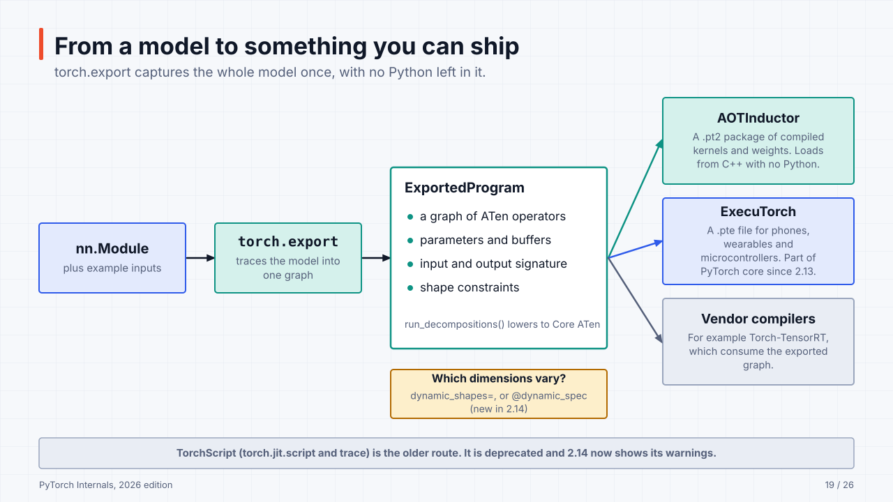

```python
ep = torch.export.export(model, (example_input,))
print(ep)                       # a graph of ATen operators, plus a description of inputs and outputs
```

An **`ExportedProgram`** holds a graph of operators, the model's parameters and buffers, a *signature* (which inputs and outputs the graph has), and *constraints* on dynamic shapes. If the model cannot be captured as one graph, export raises an error instead of silently working around it. `run_decompositions()` lowers the graph to Core ATen when a consumer needs the small operator set.

From an `ExportedProgram` there are several routes:

- **AOTInductor** compiles the graph ahead of time into a **`.pt2` package**: compiled kernels plus weights, loadable from C++ with no Python installed.

  ```python
  path = torch._inductor.aoti_compile_and_package(ep, package_path="model.pt2")
  model = torch._inductor.aoti_load_package(path)
  ```

  Recent releases added zero-copy weight sharing between several loaded models and asynchronous constant loading, which matter for servers that host many variants of one base model.
- **ExecuTorch** targets phones, wearables and microcontrollers, with backends for different chips. It became **part of PyTorch core in 2.13**, so on-device inference is now a first-class part of the framework instead of a separate project.
- **Vendor compilers** such as Torch-TensorRT consume the exported graph.

**Compile or export?** Use `torch.compile` to make your Python program faster while staying in Python. Use `torch.export` when you need a self-contained artifact.

**TorchScript** (`torch.jit.script` and `torch.jit.trace`), the 2019-era route to deployment, is deprecated. The 2.14 release makes its deprecation warnings visible and keeps it out of normal import paths. The source still lives under `torch/csrc/jit/`, which is why you may still run into it when reading the repository. For new work, use export.

> **In one sentence:** `torch.export` captures a whole model as one strict graph with no Python left, and that graph can be compiled to a package for servers or lowered to ExecuTorch for devices.

---

## Part 7: Distributed training

Modern models do not fit on one GPU, and even those that do train faster on many. `torch.distributed` is the part of PyTorch that spreads one training job across many processes and many GPUs.

### 7.1 The basics

You start **one process per GPU**, usually with `torchrun`:

```bash
torchrun --nproc_per_node=8 train.py
```

Each process has a **rank** (its number) and knows the **world size** (how many processes). Processes cooperate through **collectives**: operations that every rank joins together.

| Collective | What it does |
| --- | --- |
| `all_reduce` | Every rank ends up with the sum (or average) of everyone's tensor |
| `all_gather` | Every rank ends up with all ranks' tensors, concatenated |
| `reduce_scatter` | Sum across ranks, then each rank keeps one slice of the result |
| `broadcast` | One rank sends its tensor to everyone |
| `all_to_all` | Every rank sends a different piece to every other rank |

A **backend** implements these. On NVIDIA GPUs the backend is NCCL (AMD has an equivalent). Gloo handles CPUs. The library layer that ties them together is called **c10d**, with a `ProcessGroup` object per group of ranks.

### 7.2 Ways to split the work

| Strategy | What is split | In PyTorch |
| --- | --- | --- |
| Data parallel | The batch | `DistributedDataParallel` (DDP) |
| Sharded data parallel | Batch *and* parameters, gradients and optimizer state | FSDP2 (`fully_shard`) |
| Tensor parallel | Individual weight matrices | `parallelize_module` with DTensor |
| Pipeline parallel | Groups of layers | `torch.distributed.pipelining` |
| Context parallel | The sequence length | Context-parallel utilities |
| Expert parallel | The experts of a mixture-of-experts layer | Early work such as `TokenSwitch` (2.14) |

Large runs combine several of these at once. [torchtitan](https://github.com/pytorch/torchtitan) is the PyTorch team's reference for training large models this way.

**DDP** keeps a full copy of the model on every GPU. It hooks into autograd (Part 3): as gradients become ready during backward, DDP all-reduces them in buckets, *overlapping* communication with the rest of the backward pass, so every replica applies the same update.

### 7.3 DTensor and device meshes

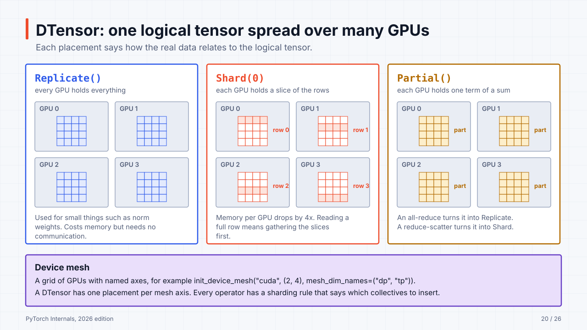

Sharding by hand is error-prone. **DTensor** is a tensor subclass (remember `__torch_dispatch__`) that represents *one logical tensor* spread over many GPUs. Each DTensor has a **placement** for each axis of a **device mesh**, a named grid of GPUs:

```python
from torch.distributed.device_mesh import init_device_mesh
from torch.distributed.tensor import distribute_tensor, Shard, Replicate

mesh = init_device_mesh("cuda", (2, 4), mesh_dim_names=("dp", "tp"))
w = distribute_tensor(torch.randn(8192, 8192), mesh, [Replicate(), Shard(0)])
```

The three placements are:

- **`Replicate()`**: every GPU holds a full copy.
- **`Shard(dim)`**: each GPU holds a slice along `dim`.
- **`Partial()`**: each GPU holds one *term* of a sum that has not been added up yet. An all-reduce turns it into `Replicate`; a reduce-scatter turns it into `Shard`.

Because DTensor sits in the dispatcher, every operator needs a **sharding rule** that says what output placement it produces and which collectives (if any) to insert. Writing these is a large part of the work: by 2.14 DTensor had rules for 1,239 operators, up from 585 in January 2026, and the team keeps moving rules to a simpler per-mesh-dimension style.

### 7.4 FSDP2

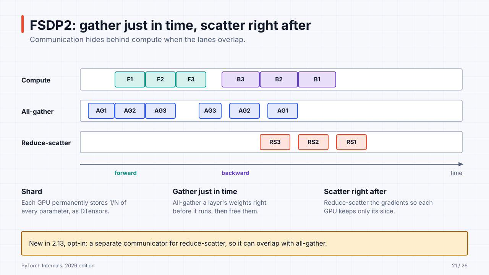

**FSDP2** (fully sharded data parallel, version 2) is the standard way to train models too large to replicate. Its idea:

- **Shard**: each GPU permanently stores only 1/N of every parameter (as DTensors), plus the matching gradient and optimizer state.
- **Gather just in time**: right before a layer runs, an *all-gather* collects its full weights from all GPUs. After it runs, the full weights are freed.
- **Scatter right after**: after backward computes a layer's gradients, a *reduce-scatter* sums them across GPUs and gives each GPU only its own slice.

The timeline above shows why this is fast: the all-gather for the *next* layer runs while the current layer computes, so most communication is hidden behind compute. In 2.13, an opt-in `set_separate_reduce_scatter_group` option gives the reduce-scatter its own communicator so it can also overlap with all-gather.

Usage is deliberately small:

```python
from torch.distributed.fsdp import fully_shard

for block in model.layers:
    fully_shard(block)        # shard each block separately
fully_shard(model)            # then the root module
```

### 7.5 What is new in 2026

- **A rewritten NCCL backend** (previewed in 2.14, ported from a project called **torchcomms**) supports fault tolerance and one-sided operations. The release notes say it is planned to become the default from PyTorch 2.15.
- **Fault tolerance as a core concept.** A process group can be reconfigured *in place* when a rank fails, instead of tearing down and restarting the whole job. A backend-agnostic **Flight Recorder** keeps a trace of recent collectives so you can diagnose hangs on any backend, not only NCCL.
- **One-sided operations** (`get` and `put` windows, and symmetric memory) let one rank read or write another's memory without the other joining a collective. This suits irregular patterns like embedding lookups and expert routing.
- **Differentiable collectives** (2.11): you can backpropagate *through* a collective.
- **Compile and distributed together:** Inductor now overlaps communication with compute by default, and "compile on one rank" removes redundant compiles.
- **Monarch**, a single-controller approach: one Python program orchestrates many GPUs rather than every GPU running its own copy of the script. It has been extended to AMD GPUs.

> **In one sentence:** `torch.distributed` runs one process per GPU and combines them with collectives; DTensor describes how a tensor is spread over a device mesh, and FSDP2 uses that to keep only a slice of the model on each GPU, gathering weights just in time.

---

## Part 8: Writing kernels

This part is the updated version of the second half of the 2019 talk. A **kernel** is the code that actually computes something on a device. In 2026 there are three common places to write one, and the right choice depends on who needs it.

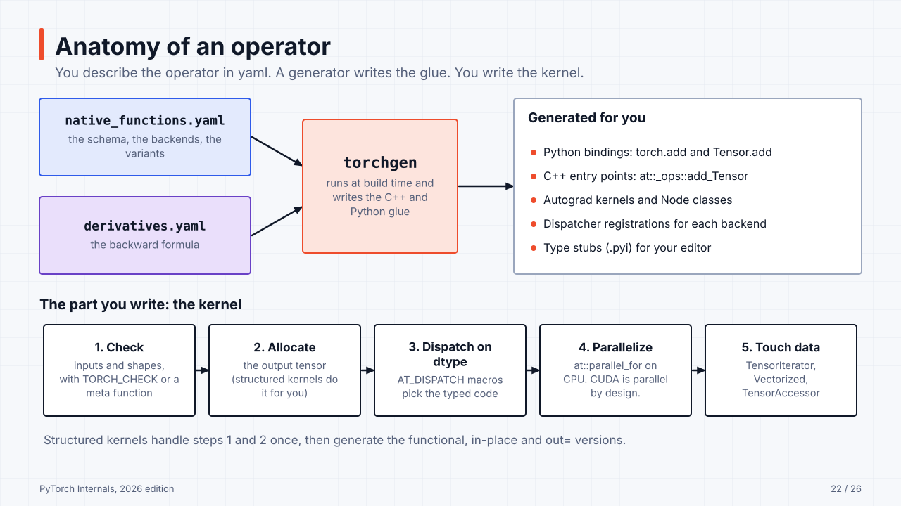

### 8.1 The anatomy of a C++ operator

To add an operator to PyTorch itself, you write two small descriptions and one kernel. A code generator called **torchgen** turns the descriptions into the glue from Part 2: the Python binding, the C++ entry point, the autograd kernel and the dispatcher registrations. You never write that glue by hand.

**1. The schema, in `aten/src/ATen/native/native_functions.yaml`.** It gives the operator's typed signature and says which backends implement it. An abridged, illustrative entry for a made-up operator:

```yaml
- func: scale_shift(Tensor self, Scalar a, Scalar b) -> Tensor
  variants: function, method          # torch.scale_shift(x, ...) and x.scale_shift(...)
  dispatch:
    CPU: scale_shift_cpu
```

**2. The derivative, in `tools/autograd/derivatives.yaml`**, if the operator is differentiable:

```yaml
- name: scale_shift(Tensor self, Scalar a, Scalar b) -> Tensor
  self: grad * a                      # d/dx (x*a + b) = a
```

**3. The kernel, in C++ under `aten/src/ATen/native/`.** A good kernel follows five steps, which are the same ones as in 2019:

1. **Check the inputs.** Error messages matter a great deal to the people who hit them, so do not skimp. `TORCH_CHECK(condition, "message", values...)` lets you mix text and values in the message.
2. **Allocate the output.**
3. **Dispatch on dtype** with an `AT_DISPATCH_...` macro.
4. **Parallelize** across CPU threads (CUDA kernels are parallel by construction).
5. **Read and write elements.**

Here is an illustrative CPU version:

```cpp
Tensor scale_shift_cpu(const Tensor& self, const Scalar& a, const Scalar& b) {
  TORCH_CHECK(self.is_floating_point(),                      // 1. check
              "scale_shift: expected a floating point tensor, got ", self.scalar_type());
  Tensor out = at::empty_like(self);                         // 2. allocate
  auto iter = TensorIterator::unary_op(out, self);           //    handles strides and broadcasting
  AT_DISPATCH_FLOATING_TYPES_AND2(kHalf, kBFloat16,          // 3. dtype dispatch
      self.scalar_type(), "scale_shift_cpu", [&] {
    const scalar_t av = a.to<scalar_t>(), bv = b.to<scalar_t>();
    cpu_kernel(iter, [=](scalar_t x) -> scalar_t {           // 4 and 5: TensorIterator loops over
      return x * av + bv;                                    //    elements and splits work across threads
    });
  });
  return out;
}
```

**The helpers**, updated for 2026:

- **`TensorIterator`** is the workhorse for elementwise operators. It deals with broadcasting, type promotion, non-contiguous inputs and threading, so your lambda sees one element at a time. Use it whenever access is regular.
- **`at::parallel_for`** replaced raw OpenMP pragmas as the way to split a loop across threads when you are not using `TensorIterator`.
- **`Vectorized<T>`** (called `Vec256` in 2019) wraps SIMD instructions. Helpers like `cpu_kernel_vec` take a scalar lambda and a vectorized lambda. The build compiles the kernel several times for different instruction sets (AVX2, AVX-512, ARM SVE) and picks the best at run time.
- **`TensorAccessor`** gives indexed access with strides handled for you, with dimensionality and dtype fixed in the type. For CUDA kernels use `packed_accessor32`, because 32-bit indexing is much faster on GPUs than the 64-bit default.
- **Structured kernels** are the modern pattern for operators with many variants. You write one `TORCH_META_FUNC` (check inputs, compute the output's shape and dtype) and one `TORCH_IMPL_FUNC` (do the work). torchgen then derives the functional (`abs`), in-place (`abs_`) and `out=` (`abs.out`) versions from them. In 2019 you wrote three operators by hand.

**4. The tests.** Operators are tested through a shared database called **OpInfo**, so one entry exercises your operator on every device and dtype, checks it against a reference and runs gradient checks (`torch.autograd.gradcheck`). Add an OpInfo rather than writing ad hoc tests.

**What happened to the "bad part of town"?** The 2019 talk warned about legacy `TH` and `THC` kernels: C code, manual reference counting, files compiled several times with different `#define`s, which reviewers disliked. Those have been ported to modern ATen, and the current contributing guide no longer lists them. If an old tutorial tells you to edit a file with `TH` in its name, treat it as history.

### 8.2 Three places to put a new kernel

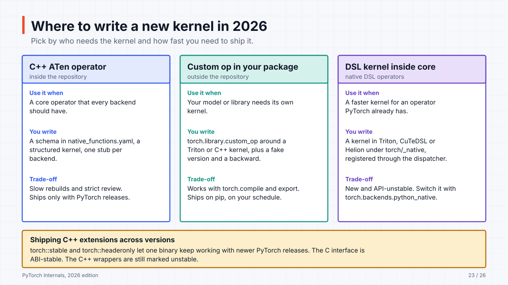

**Option 1: a C++ ATen operator.** Right for a *core* operator that every backend should have. Cost: slow rebuilds, strict review, and it only ships with a PyTorch release.

**Option 2: a custom op in your own package.** This is the right default if *your* model or library needs a special kernel. You write the kernel in whatever language you like (Triton, CUDA, C++), wrap it with `torch.library.custom_op`, and tell PyTorch two more things: what the output looks like *without running the kernel* (so the compiler can trace it) and how to differentiate it.

```python
import torch, triton
import triton.language as tl
from torch.library import custom_op

@triton.jit
def _scale_shift_kernel(x_ptr, out_ptr, a, b, n, BLOCK: tl.constexpr):
    offs = tl.program_id(0) * BLOCK + tl.arange(0, BLOCK)
    mask = offs < n
    x = tl.load(x_ptr + offs, mask=mask)
    tl.store(out_ptr + offs, x * a + b, mask=mask)

@custom_op("mylib::scale_shift", mutates_args=())
def scale_shift(x: torch.Tensor, a: float, b: float) -> torch.Tensor:
    x = x.contiguous()
    out = torch.empty_like(x)
    n = x.numel()
    _scale_shift_kernel[(triton.cdiv(n, 1024),)](x, out, a, b, n, BLOCK=1024)
    return out

@scale_shift.register_fake                  # used by FakeTensor / the compiler (Part 5)
def _(x, a, b):
    return torch.empty_like(x)

def _setup_context(ctx, inputs, output):
    ctx.a = inputs[1]

def _backward(ctx, grad):                   # becomes the node autograd creates (Part 3)
    return grad * ctx.a, None, None

scale_shift.register_autograd(_backward, setup_context=_setup_context)
```

Each piece connects to a layer you already know: the op is registered with the dispatcher, `register_fake` serves FakeTensor, and `register_autograd` supplies the Autograd key's kernel. The result works in eager mode, under `torch.compile` and under `torch.export`. (If you want Inductor to look *inside* your Triton kernel and fuse around it, there is a variant, `torch.library.triton_op`.)

**Option 3: a DSL kernel inside core.** A newer path, from PyTorch 2.13 on. GPU kernel languages such as **Triton**, **CuTeDSL** and **Helion** have become powerful enough that core PyTorch now has a place for kernels written in them: a `torch/_native/` directory, with every kernel *registered through the dispatcher* like any other operator, and a switch, `torch.backends.python_native`, to turn them on or off. FlashAttention-4 was the motivating case: it is written in CuTeDSL and was integrated into core first, and then the project formalized the rules. Helion registered as a third entry in 2.14, although no operators were routed through it yet in that release. Two things to know:

- **Triton** is a Python-like language where you write the computation for one *tile* of data, and the compiler handles the thread-level details.
- **Helion** raises this one level further: you write the algorithm and Helion *searches* over tile sizes, loop orders and memory-access patterns, then emits Triton.

All of this is marked API-unstable. It is the fastest-moving corner of the codebase.

**Shipping C++ extensions across versions.** If you do write C++, your compiled extension used to break whenever PyTorch changed internals. The `torch::stable` API and the header-only `torch::headeronly` utilities aim to fix that, so one binary can keep working with newer PyTorch releases. The C interface is ABI-stable. The C++ wrappers around it are still marked unstable, and 2.13 and 2.14 each widened what is available (for example, access to the random number generator).

> **In one sentence:** for most people the right move is a custom op in your own package; contribute to core only for operators every backend needs, and watch the new DSL path for faster kernels.

---

## Part 9: A map of the repository

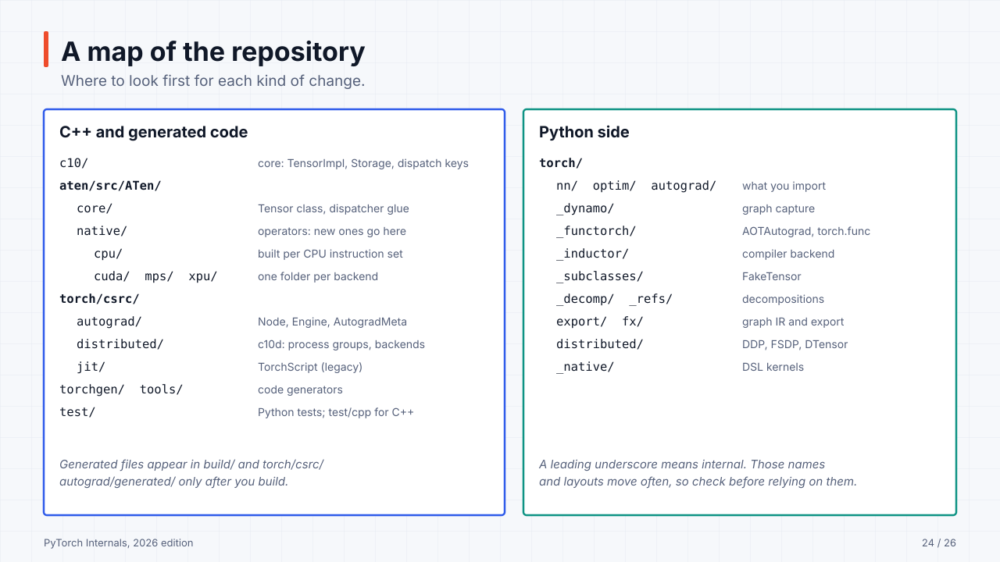

PyTorch has a lot of folders, and the [CONTRIBUTING guide](https://github.com/pytorch/pytorch/blob/main/CONTRIBUTING.md#codebase-structure) describes them in detail. These are the ones to learn first.

**C++ side**

- **`c10/`** holds the core abstractions that work everywhere, including mobile: the actual `TensorImpl` and `Storage`, dispatch keys, small utilities. The name is a pun on Caffe2 and ATen (a "Caffe 10"), though nobody remembers exactly what the original joke was.
- **`aten/src/ATen/`** is the tensor library. `core/` has the `Tensor` class and dispatcher glue. **`native/`** is where operators live, with subfolders such as `cpu/` (code compiled for specific CPU instruction sets), `cuda/`, `mps/` and `xpu/`. If you are working on an operator, you will spend most of your time here.
- **`torch/csrc/`** is the frontend: Python bindings (files prefixed `python_`), the autograd engine, `distributed/` (c10d), and the legacy TorchScript compiler in `jit/`.
- **`torchgen/`** and **`tools/`** hold the code generators.
- **`test/`** has the tests: `test_torch.py`, `test_autograd.py`, `test_nn.py` and many more, plus `test/cpp` for C++.

**Python side (`torch/`)**: user-facing modules (`nn`, `optim`, `autograd`) plus the compiler and distributed stacks, most of which are in directories starting with an underscore, which means *internal*: `_dynamo` (graph capture), `_functorch` (AOTAutograd, `torch.func`), `_inductor` (compiler backend), `_subclasses` (FakeTensor), `_decomp` and `_refs` (decompositions), `_native` (DSL kernels). Public graph tools live in `export/` and `fx/`, and distributed code in `distributed/` (DDP, FSDP, DTensor, pipelining). Internal names and layout change often.

### How to find the code behind `torch.foo`

1. Search `native_functions.yaml` for `func: foo`. Its `dispatch:` field tells you which function implements it on which backend. If there is a `structured_delegate`, follow it to the `.out` entry.
2. Search `aten/src/ATen/native/` for that function name. CPU loops for elementwise operators are often in `native/cpu/*Kernel.cpp`, reached through a *stub*.
3. For the backward formula, search `tools/autograd/derivatives.yaml` for `name: foo`.
4. If you cannot find a C++ function, the operator may be defined in Python: look in `torch/_refs/` and `torch/_decomp/`.
5. Remember that the generated glue only exists after a build. Look under `build/` and `torch/csrc/autograd/generated/`.

To see what actually runs for a Python call, use the `LogOps` dispatch mode from Part 2, or a profiler trace. They show the real operator and kernel names to search for.

---

## Part 10: Working on PyTorch efficiently

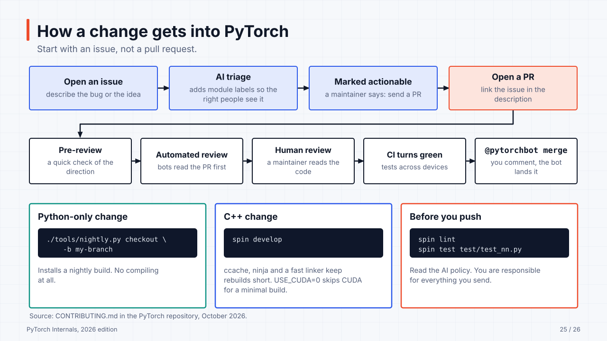

In 2019 the post warned that two things stop people from contributing: the size of the C++ codebase, and an inefficient workflow. The second one still bites. If you work on C++ with Python habits, you will have a bad time: rebuilds are slow and feedback is slow.

### 10.1 Pick the right build for your change

- **Python-only change?** Do not compile anything. `tools/nightly.py` checks out a branch and installs a pre-built nightly binary into your repository, so your Python edits take effect immediately:

  ```bash
  ./tools/nightly.py checkout -b my-branch
  source venv/bin/activate
  ```

- **C++ change?** Do an editable build. The current guide recommends `spin develop` (or `python -m pip install --no-build-isolation -v -e .`). You need a C++20 toolchain (GCC 11.3 or later, Clang 16 or later, or MSVC 2022), and CUDA 12.8 or later for CUDA builds.
- **Build only what you need.** A minimal CPU-only build (`USE_CUDA=0 USE_DISTRIBUTED=0 USE_MKLDNN=0 BUILD_TEST=0` and a few more switches listed in the guide) is dramatically faster. Turn features back on only when your change needs them.
- **Make no-op rebuilds fast.** Use **ninja**, **ccache** and a fast linker such as **mold** or **lld**. Edit `.cpp` files instead of headers when you can: changing a header included by many files, especially by CUDA files, triggers a huge rebuild. Changing `native_functions.yaml` rebuilds more than a thousand files, and precompiled headers (`USE_PRECOMPILED_HEADERS=1`) can help.
- **Use a beefy machine.** CPU cores and RAM matter. Building CUDA on a laptop is slow.

### 10.2 Test and lint locally

```bash
spin lint                                  # fast linters on everything, slow ones on changed files
spin test test/test_nn.py -k Linear        # run a focused set of tests with pytest
```

CI is a wonderful zero-setup way to find out whether your change works, but it takes a while to report back, so for experiments that need many iterations, set up a local environment instead.

### 10.3 Debug like a native

- `TORCH_SHOW_CPP_STACKTRACES=1` prints the C++ stack when an error reaches Python.
- `py-spy record --native -o profile.svg -- python script.py` profiles Python and C++ together and writes a flame graph.
- `tools/build_with_debinfo.py path/to/file.cpp` rebuilds only one file with debug symbols, which gives you a readable debugger session without a full debug build.
- `pytorch-gdb` adds commands like `torch-tensor-repr` to print tensors from inside gdb.
- For CUDA code, `compute-sanitizer` and `cuda-gdb` are the best friends, and effective memory bandwidth is the right metric to measure for memory-bound kernels.

### 10.4 The contribution process

Since 2026 the process is more structured, and it is the first thing to read. In short:

1. **Start with an issue**, not a pull request. Bots triage new issues by module so the right maintainers see them.
2. A maintainer marks the issue **`actionable`** when it has enough detail for anyone to write a good patch. Issues labeled `good first issue` are the simplest ones.
3. **Open a PR that links the issue.** Without a linked `actionable` issue (or a maintainer's prior approval) a PR is generally closed.
4. The PR gets a quick **pre-review** of its direction, an **automated review**, then **human review**.
5. When CI is green and a reviewer approves, you comment `@pytorchbot merge`.

PyTorch also has an **AI policy**. You are personally responsible for everything you submit, and low-quality or overly verbose AI-generated issues and PRs will not be accepted. Short, specific issues describing a real problem are best.

Not every contribution is code. Improving documentation, reproducing bug reports and commenting on RFCs are all valuable.

---

## Part 11: What changed, and what to watch

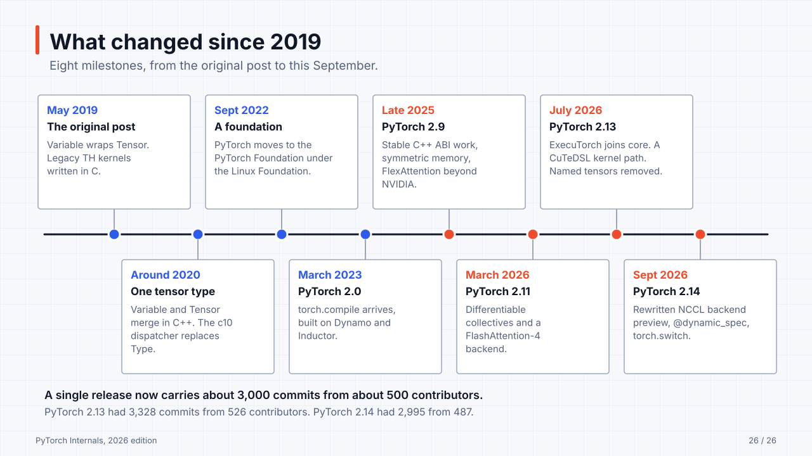

A few threads run through the last seven years.

**The framework became a platform.** The 2.x series keeps pushing PyTorch from a research-first framework toward a hardware-agnostic platform for production training and inference. A single release is now about 3,000 commits from about 500 contributors (2.13: 3,328 commits and 526 contributors; 2.14: 2,995 and 487).

**It stopped being one project.** PyTorch moved to the **PyTorch Foundation** under the Linux Foundation in 2022. Its projects now include PyTorch itself (with ExecuTorch), **vLLM** (LLM serving), **DeepSpeed** (large-scale training), **Ray** (distributed computing), **Helion** (the kernel language) and **Safetensors** (the weight file format; `torch.load("model.safetensors")` works natively since 2.13).

**Old things were retired.** Named tensors were removed in 2.13, along with the Bazel build. TorchScript is deprecated. The legacy `TH`/`THC` kernels from the 2019 talk have been ported to modern C++. Release notes now classify features simply as API-stable or API-unstable instead of prototype, beta and stable.

**Things to watch next**, from the release notes and the work in flight:

- The rewritten NCCL backend becoming the default (planned for 2.15).
- `torch.compile` support for Python 3.15 and the free-threaded interpreter.
- DSL-written operators (Triton, CuTeDSL, Helion) replacing more hand-written CUDA in core.
- Fault-tolerant training becoming routine.
- More of the stack on non-NVIDIA hardware: AMD ROCm, Intel XPU and Apple Silicon, where kernels are moving from vendor graph libraries to hand-written Metal.
- Declarative dynamic shapes (`@dynamic_spec`) settling down.

---

## Ten things to try

Learning sticks when you poke at it. Each of these takes a few minutes.

1. **Predict strides.** For `x = torch.randn(2, 3, 4)`, write down `x.permute(2, 0, 1).stride()` before running it. Then check `is_contiguous()`.
2. **Prove a view shares memory.** Make `b = a[1]`, write `b[0] = 99`, and print `a`. Compare `a.untyped_storage().data_ptr()` with `b.untyped_storage().data_ptr()`.
3. **Watch the version counter.** Print `y._version` before and after `y.add_(1)`.
4. **Trigger the in-place error** from Part 3 on purpose, then fix it.
5. **Walk the autograd graph.** Starting at `loss.grad_fn`, loop over `next_functions` and print the node names until you reach `AccumulateGrad`.
6. **Log the operators** of a small `nn.Linear` plus `relu` with the `LogOps` mode, forward and backward.
7. **Cause a graph break** with `.item()`, find it with `TORCH_LOGS=graph_breaks`, and remove it.
8. **Read generated kernels.** Compile `lambda x: torch.relu(x * 2 + 1)` and run with `TORCH_LOGS=output_code`.
9. **Time honestly.** Benchmark a matrix multiply with and without `torch.cuda.synchronize()` and see the difference.
10. **Write a custom op** with the Part 8 example, then call it inside a `torch.compile`d function.

---

## Questions readers asked in 2019 (and a few more)

**If tensors are stored row-major, why is the batch dimension first? Isn't that inefficient for GPUs?**
Dimension *order* in the shape is a logical convention, not a statement about speed. GPU kernels parallelize across whichever dimensions suit them, and strides let the physical order differ from the logical one (`channels_last` is the standard example). Layout choices are made by changing strides, not by reordering your code.

**Can I profile my model layer by layer?**
Yes. `torch.profiler` with `record_function` scopes gives you named regions in a trace, and forward hooks on modules (`register_forward_hook`) can wrap each layer. For the backward pass, remember it is one graph of nodes, not one function per layer, so use the profiler's GPU timeline rather than trying to hook "each layer's backward".

**Can multiple threads fight over CPU cores?**
Yes. PyTorch uses *intra-op* threads (to speed up a single operator) and *inter-op* threads (to run independent operators concurrently). Combined with other libraries that bring their own OpenMP thread pools, you can oversubscribe the machine. Check `torch.get_num_threads()`, set `OMP_NUM_THREADS` or call `torch.set_num_threads(n)`, and measure.

**What does `c10` stand for?**
Nobody agrees. Caffe tensor, core tensor and "Caffe 10" have all been offered. When a commenter on the original post asked, the original author's answer was that this ambiguity is why it was named that way.

**Will this post go out of date?**
Parts of it will, and soon. The ideas (a tensor is metadata plus storage, calls pass through a dispatcher, autograd records a graph, compilers fuse) have been stable for years. The *files and APIs* change monthly. When in doubt, grep the repository and read the release notes.

---

## Environment variable cheat sheet

| Variable | Effect |
| --- | --- |
| `TORCH_LOGS=graph_breaks,recompiles,output_code` | Compiler diagnostics (comma-separated list) |
| `TORCH_TRACE=/tmp/trace` | Structured compile trace for the `tlparse` tool |
| `TORCH_SHOW_CPP_STACKTRACES=1` | C++ stack trace on Python errors |
| `CUDA_LAUNCH_BLOCKING=1` | Make every CUDA launch synchronous, to find the failing line |
| `PYTORCH_ALLOC_CONF=expandable_segments:True` | Reduce GPU memory fragmentation |
| `OMP_NUM_THREADS=n` | Number of CPU threads for intra-op parallelism |
| `USE_CUDA=0`, `USE_DISTRIBUTED=0`, `BUILD_TEST=0` | Build-time switches for a faster minimal build |

---

## Further reading

**The original**
- Edward Z. Yang, ["PyTorch internals"](https://blog.ezyang.com/2019/05/pytorch-internals/) (2019). The post this one is modeled on.
- Edward Z. Yang, ["Let's talk about the PyTorch dispatcher"](http://blog.ezyang.com/2020/09/lets-talk-about-the-pytorch-dispatcher/) (2020). A deeper dive into dispatch keys.
- The [Stride Visualizer](https://ezyang.github.io/stride-visualizer/index.html).

**Current sources used for this edition**
- PyTorch release blogs: [2.9](https://pytorch.org/blog/pytorch-2-9/), [2.11](https://pytorch.org/blog/pytorch-2-11-release-blog/), [2.13](https://pytorch.org/blog/pytorch-2-13-release-blog/) and [2.14](https://pytorch.org/blog/pytorch-2-14-release-blog/).
- [CONTRIBUTING.md](https://github.com/pytorch/pytorch/blob/main/CONTRIBUTING.md) in the PyTorch repository, for the build, test and PR workflow.
- ["Native-ops DSL support in PyT core"](https://dev-discuss.pytorch.org/t/native-ops-dsl-support-in-pyt-core/3324) on the PyTorch developer forum, for the DSL kernel path.

**To go deeper**
- The PyTorch 2 paper, "PyTorch 2: Faster Machine Learning Through Dynamic Python Bytecode Transformation and Graph Compilation" (ASPLOS 2024), for the design of Dynamo and Inductor.
- The official `torch.compile`, `torch.export`, `torch.distributed` and `torch.library` documentation.
- The [PyTorch developer forum](https://dev-discuss.pytorch.org/), where design discussions happen in the open.
- The READMEs inside the repository: `aten/src/ATen/native/README.md` and `torch/csrc/autograd/README.md`.

---

## About this edition

The text and all 26 slide images are new. The images are hand-built SVG files, so they stay sharp at any size and can be edited in any text editor. The whole post is plain Markdown: it can be saved, printed or converted to any format without a special viewer.

Thanks to Edward Z. Yang for the original talk and essay that made the PyTorch codebase approachable for so many people, and to the many contributors whose work is summarized here.
